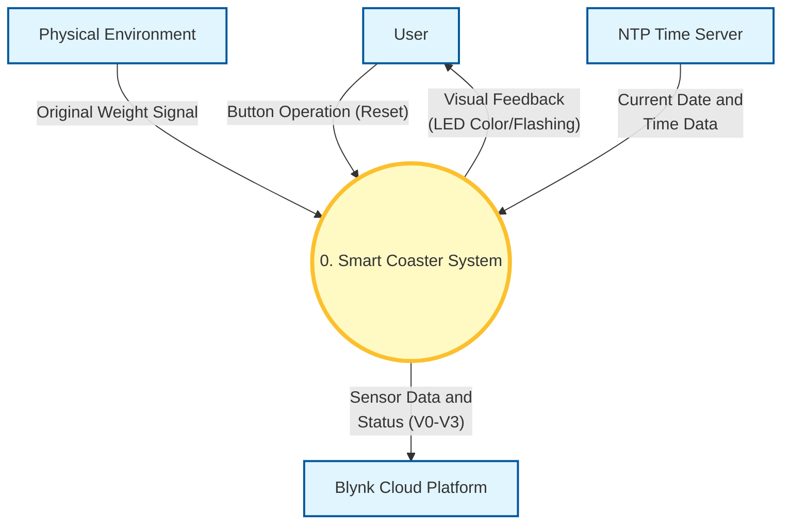
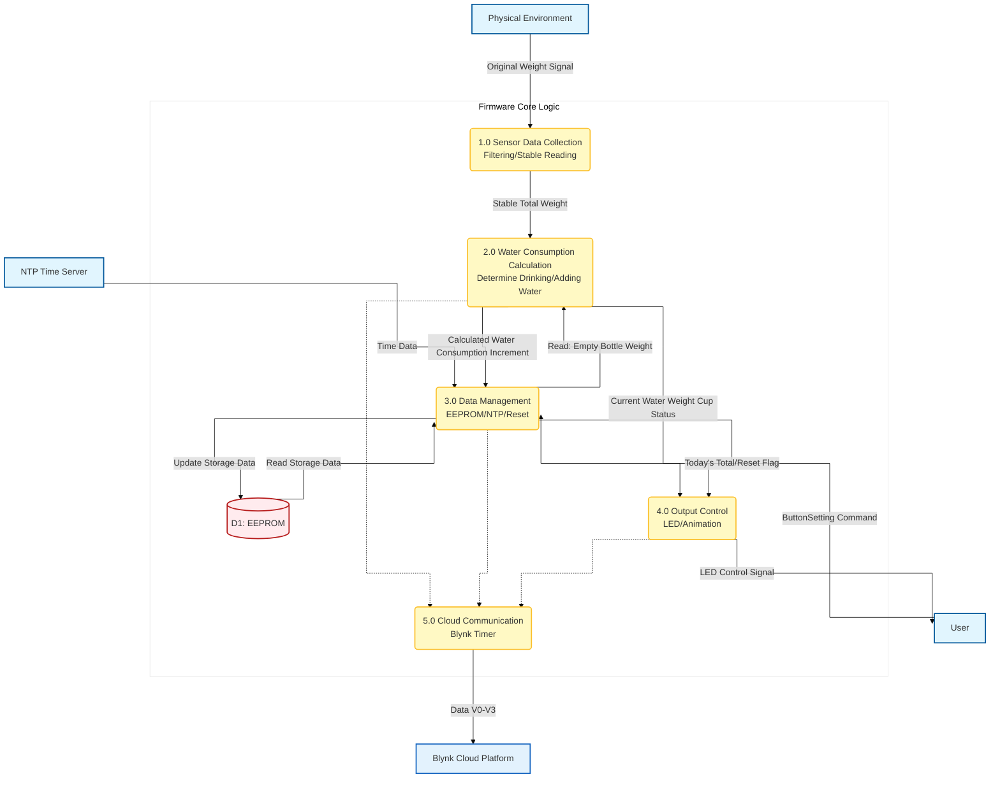

# Smart Coaster - 114NTUST\_IIOT

## When was the last time you took a sip of water?

For students like us, or for office workers who spend long hours at a desk, the answer is often, ''I don't remember.''

* BECAUSE : An Overlooked Office Wellness Problem
1. The Cost of Deep Work: When we are immersed in our work, our brains automatically ignore physiological signals like thirst.
2. Busyness as the Norm: Meetings, classes, and endless to-do lists push drinking water to the bottom of our priorities.
3. The Invisible Health Hazard: Chronic dehydration can lead to decreased focus, fatigue, and even long-term health problems.

* SO our Solution : The Smart Coaster
1. Low Cost: Our material budget is extremely low, which we will detail in the BOM.
2. Zero-Effort Automatic Tracking: The user doesn't need to do anything. Just place the cup on the coaster.
3. Smart Reminders with LED Light: We use visual light cues instead of phone notifications, which is more intuitive and less disruptive.
4. Use your existing drinkware: Whether it's a mug or a thermos, it works with our coaster.

## Team Members's Role
| Name     | Student ID  | Assignment |
|----------|-------------|---------|
| 楊婕     | M11451001   |    |
| 楓尹翔   | M11451007   |    |
| 簡翊程   | M11451011   |    |
| 顏梓淮   | M11451027   |    |
| 吳家瑜   | M11451029   |    |

## Hardware

Assemble the components according to the diagram.

* For ESP32 TO HX711  (RED line)

  。The VCC pin connects to the 3V3 pin.

  。The DT pin connects to GPIO8.

  。GND connects to GND.

  。The SCK pin connects to GPIO9.

* For ESP32 TO LED strip  (BLUE line)

  。GND connects to GND.

  。DIN connects to GPIO10.

  。+5V connects to 5V.

* For ESP32 TO Button  (GREEN line)

  。Point A connects to GPIO18.

  。Point B connects to GND.
# 智慧杯墊系統設計圖

## DFD Level 0: Comtext Diagram

## DFD Level 1: Decomposition Diagram

