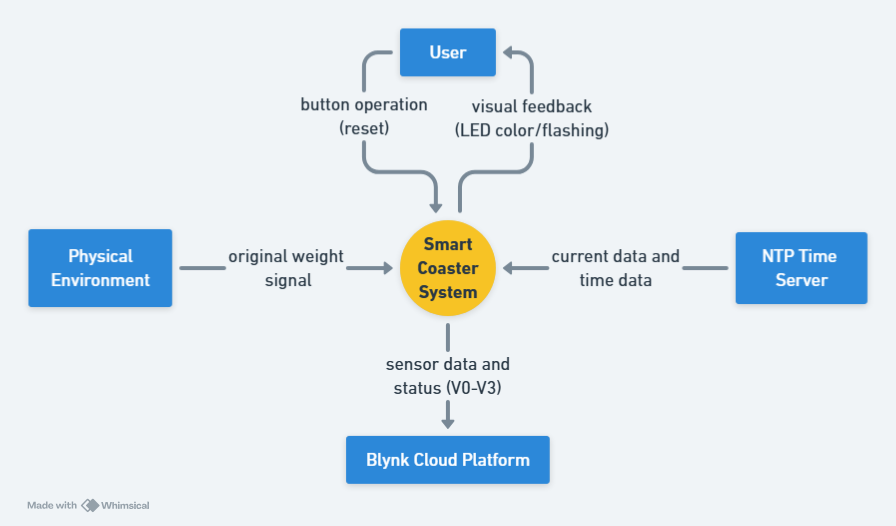
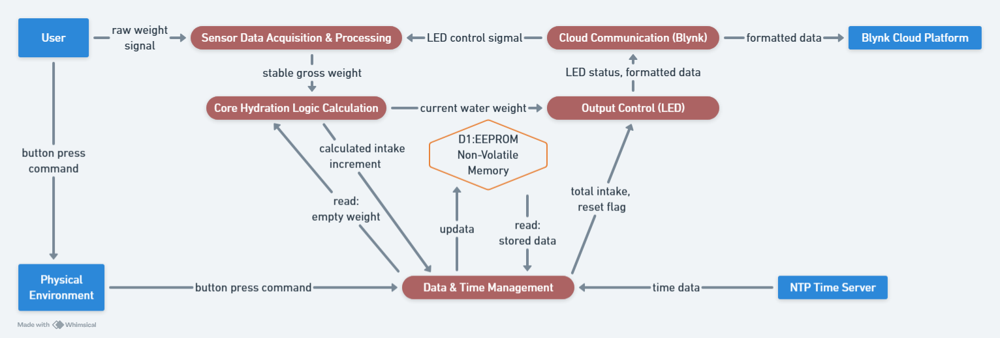
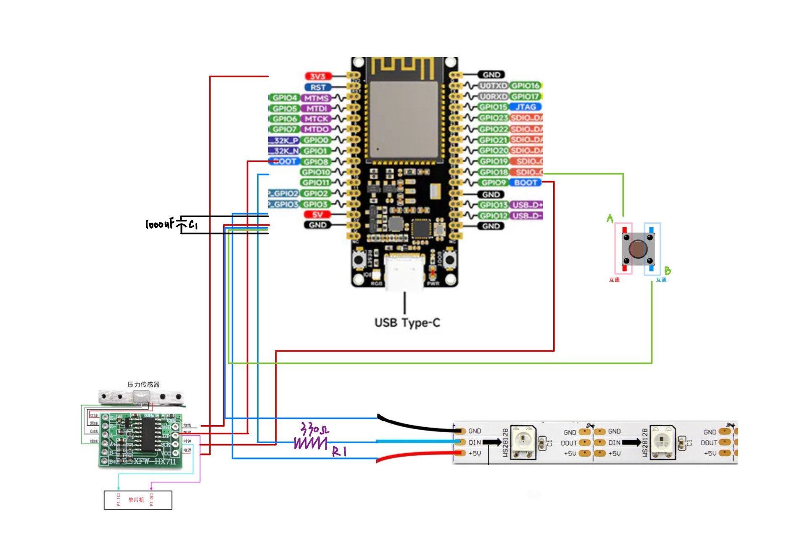
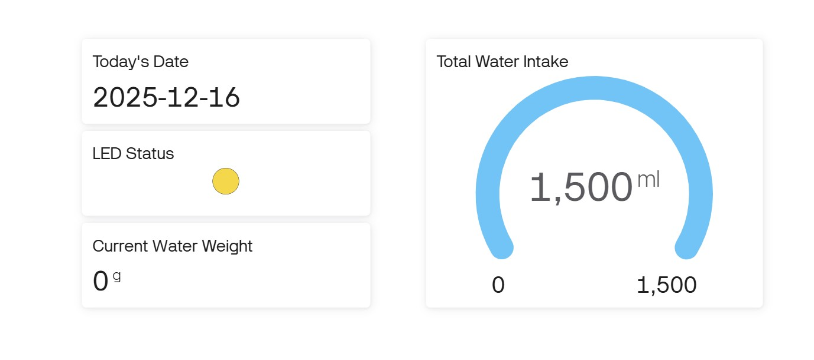
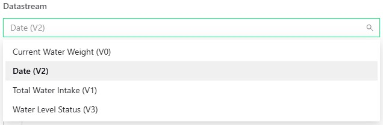
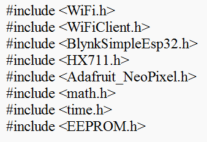
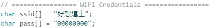

# Smart Coaster - 114NTUST\_IIOT

## When was the last time you took a sip of water?

For students like us, or for office workers who spend long hours at a desk, the answer is often, ''I don't remember.''

* BECAUSE : An Overlooked Office Wellness Problem
1. The Cost of Deep Work: When we are immersed in our work, our brains automatically ignore physiological signals like thirst.
2. Busyness as the Norm: Meetings, classes, and endless to-do lists push drinking water to the bottom of our priorities.
3. The Invisible Health Hazard: Chronic dehydration can lead to decreased focus, fatigue, and even long-term health problems.

* SO our Solution : The Smart Coaster
1. Low Cost: Our material budget is extremely low, which we will detail in the BOM.
2. Zero-Effort Automatic Tracking: The user doesn't need to do anything. Just place the cup on the coaster.
3. Smart Reminders with LED Light: We use visual light cues instead of phone notifications, which is more intuitive and less disruptive.
4. Use your existing drinkware: Whether it's a mug or a thermos, it works with our coaster.

## Smart Coaster System Design Drawing

* DFD Level 0: Comtext Diagram
  
* This diagram illustrates the interaction between the System Boundary and four external entities:

    。User: Performs reset operations via buttons and receives visual feedback from LEDs.

    。Physical Environment: Provides raw weight sensing signals.

    。NTP Time Server: Provides accurate real-time time data, ensuring correct timestamps for drinking records.

    。Blynk Cloud Platform: Receives sensor data (V0-V3) for remote monitoring and visualization.
  
    

* DFD Level 1: Decomposition Diagram

* This diagram details the five core processing modules within the smart coaster and their data flow:

    。Sensor Data Acquisition: Converts analog weight signals into stable digital total weight data.

    。Core Hydration Logic: Compares current and past weights to calculate the "Intake Increment".

    。Data & Time Management: Integrates NTP time data and is responsible for writing/reading EEPROM (non-volatile memory) to ensure data is not lost after power failure.

    。Output Control: Controls the LED indicator status based on the current hydration progress.

    。Cloud Communication: Sends formatted data packets to the Blynk server.
  
    

## Hardware

Assemble the components according to the diagram.

* For ESP32 TO HX711  (RED line)

  。The VCC pin connects to the 3V3 pin.

  。The DT pin connects to GPIO8.

  。GND connects to GND.

  。The SCK pin connects to GPIO9.

* For ESP32 TO LED strip  (BLUE line)

  。GND connects to GND.

  。DIN connects to GPIO10.

  。+5V connects to 5V.

* For ESP32 TO Button  (GREEN line)

  。Point A connects to GPIO18.

  。Point B connects to GND.

## Software

* Blynk Cloud platform

    。IoT Cloud Integration: Features a built-in cloud platform that seamlessly transfers data from Arduino/ESP32 to mobile devices or web pages.

    。No Complex Coding: Eliminates the need to write complex code for mobile apps or web front-ends.

    。Drag-and-Drop Design: Allows users to quickly build monitoring dashboards by simply dragging and dropping widgets like buttons and charts.

* Add the content you need to display in Blynk. For example, we've added Today's Date, LED Status, Current Water Weight, Total Water Intake.
    

* !!! Each datascream setting must match the code settings in the Arduino; otherwise, the connection will fail.
  
    

* Arduino
  
    。Low Barrier to Entry: You can quickly write program-controlled hardware without needing to delve into low-level register operations.

    。Huge Community & Ecosystem: Whatever sensor or platform you want to connect, you can almost always find ready-made libraries and sample code.

    。High Extensibility: Arduino has a standardized pinout design.

* Include Arduino Library, We have 8 library need to include

* To avoid the problem of not being able to find the library, we chose to manually add it directly to the code.
  
    

* !!! You can directly copy our code to your Arduino, but please remember to change it to your own Wi-Fi name and password.
    
    

## Team Members's Role
| Name     | Student ID  | Assignment |
|----------|-------------|---------|
| 楊婕     | M11451001   |  PPT Design, Bill of Materials, Hardware |
| 楓尹翔   | M11451007   |  Website, Blynk platform, Presentation  |
| 簡翊程   | M11451011   |  Software, Hardware  |
| 顏梓淮   | M11451027   |  Software, Hardware  |
| 吳家瑜   | M11451029   |  Github website, System Architecture, Purchasing  |

